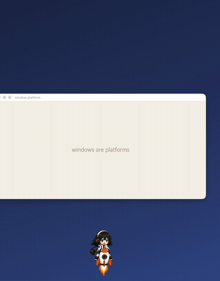
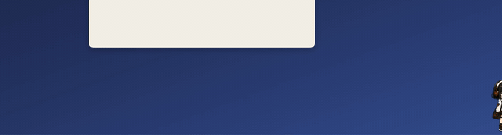
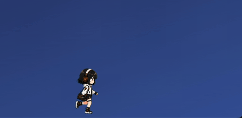

# hermes-pet

**Hermes가 모니터 위를 뛰어다닙니다.** 화면 속 창들을 발판 삼아 걷고, 로켓을 타고
다른 모니터로 날아가고, 낙하산으로 내려오고, iPad까지 건너가는 오픈소스 데스크톱 펫.

An open-source macOS desktop pet of the Hermes character — she walks on your
app windows, rockets between monitors, and can even hop over to your iPad.

[Tauri 2](https://tauri.app) (투명 · 프레임리스 · 항상 위 창) + 바닐라 TypeScript로 만들었습니다.

> 캐릭터는 [Nous Research의 hermes-agent](https://github.com/NousResearch)를 모티프로 한
> 팬 캐릭터입니다. 이 저장소는 hermes-agent 및 Nous Research와 무관한 팬 프로젝트입니다.

## 미리보기

<p align="center">
  
</p>
<p align="center"><sub>🚀 로켓 발사 → 엔진 컷 → 낙하산 → <b>창 위에 착지</b> (창의 윗변이 발판입니다)</sub></p>

<p align="center">
  
</p>
<p align="center"><sub>✈️ 옆으로 타는 제트 대시 — 내려서는 낙하산으로 착지</sub></p>

<p align="center">
  
</p>
<p align="center"><sub>🚶 산책하다가 코너를 만나면 붙잡고 올라가 앉습니다</sub></p>

동작 스프라이트 (APNG — 그대로 재생됩니다). 캐릭터는 **팩**으로 갈아끼울 수 있고,
기본 팩은 **시멍** 🐶, 옵션 팩으로 헤르메스 🎧가 들어 있습니다 (설정 패널에서 전환):

| 팩 | idle | walk | rocket | jet | fall | edge |
| :-: | :-: | :-: | :-: | :-: | :-: | :-: |
| 시멍 |  |  |  |  |  |  |
| 헤르메스 |  |  |  |  |  |  |

(위 데모 GIF들은 헤르메스 팩으로 촬영한 것입니다.)

## 기능

- 🚶 **창 위를 걷기** — 실제 앱 창의 윗변을 발판으로 인식해서 올라가 걷고, 창이 움직이면 같이 이동
- 🪂 **낙하산** — 발판이 사라지거나 높은 곳에서 내려올 때 낙하산 하강
- 🚀 **로켓 & 제트** — 수직 로켓 발사, 옆으로 타고 나는 제트 대시
- 🖥️ **멀티 모니터** — 스케일이 다른 모니터(레티나+외장) 사이를 걸어서/제트로/로켓으로 넘나듦.
  좌우 배치는 물론 위아래로 쌓인 배치도 지원 (위로는 로켓, 아래로는 다이빙)
- 📱 **iPad 핸드오프** — Lanbeam 에이전트(별도 프로젝트)가 실행 중이면 화면 끝에서 iPad로 건너감 (선택 기능, 없어도 완전히 동작)
- 🎛️ **설정 GUI** — 우클릭 메뉴 → 설정: 캐릭터 팩 전환, 크기·속도·활동성·묘기 빈도 실시간 조절 (iPad 펫에도 동기화)
- 🎭 **캐릭터 팩** — `public/packs/<이름>/`에 동작 APNG를 넣으면 새 캐릭터가 됩니다
- 🐾 **친구 소환** — 최대 3마리까지 성격(크기·걸음걸이)이 조금씩 다른 친구들을 추가
- 🔍 **인식 표시** — 어떤 창을 발판으로 인식하는지 모니터별 오버레이로 시각화
- ✋ **드래그 / 💖 클릭 반응** — 잡아 옮기면 대롱대롱, 클릭하면 하트

## 시작하기

요구 사항: [Node.js](https://nodejs.org) 18+, [Rust](https://rustup.rs) 툴체인.

```bash
npm install
npm run tauri dev     # 개발 모드 실행
npm run tauri build   # 배포용 앱 빌드
```

<details>
<summary><b>Windows에서 빌드하기</b> (실험적)</summary>

1. [Rust 설치](https://rustup.rs) — 설치 중 **MSVC 툴체인**을 선택하세요.
   Visual Studio가 없다면 rustup이 안내하는
   [Visual Studio C++ Build Tools](https://visualstudio.microsoft.com/visual-cpp-build-tools/)를
   먼저 설치해야 합니다 ("Desktop development with C++" 워크로드).
2. [Node.js](https://nodejs.org) 18+ 설치.
3. WebView2 런타임 — Windows 10/11에는 대부분 기본 포함. 없다면
   [여기서 설치](https://developer.microsoft.com/microsoft-edge/webview2/).
4. 이후는 동일합니다:

   ```powershell
   npm install
   npm run tauri dev
   npm run tauri build   # 산출물: src-tauri\target\release\bundle\
   ```

창 발판 인식은 Win32(`EnumWindows` + DWM)로 구현되어 있고 컴파일까지
확인했지만 실기기 검증 전입니다. 이상한 창이 발판으로 잡히면
`src-tauri/src/lib.rs`의 `SHELL_CLASSES` 목록에 클래스명을 추가하고
이슈로 알려주세요. iPad 핸드오프는 macOS 전용이라 자동 비활성화됩니다.

</details>

- 조작: 드래그로 이동 · 클릭으로 반응 · **우클릭**으로 메뉴(친구+/설정/인식 표시/종료)
- 창 인식은 퍼블릭 API만 사용합니다 — 별도 권한 불필요.
  (macOS `CGWindowListCopyWindowInfo` / Windows `EnumWindows` + DWM)

### 플랫폼 지원

| 플랫폼 | 상태 |
| --- | --- |
| **macOS** | 개발·검증 완료 (기본 타깃) |
| **Windows** | 실험적 — 창 발판 인식까지 Win32로 구현·컴파일 확인, 실기기 검증 전. 이슈 환영! |

iPad 핸드오프는 macOS 전용입니다(Lanbeam 에이전트가 macOS 앱).

## 나만의 캐릭터 넣기

모든 동작은 `public/<state>.apng` 스프라이트입니다 (idle / walk / drag / react /
fall / edge / rocket / jet). 같은 이름으로 교체하면 바로 적용되고, 없는 동작은
idle로 대체됩니다.

새 동작 추가 파이프라인은 `.claude/skills/add-action/SKILL.md`에 레시피로 정리되어
있습니다 — [sprite-gen](https://github.com/aldegad/sprite-gen)으로 프레임을 생성하는
모드와, 마젠타 배경 GIF를 변환하는 모드 두 가지:

```bash
# 단색 배경 GIF → 알파 APNG (크로마키 + 디스필 + 조립)
ffmpeg -i in.gif -vf "colorkey=0xFF00FF:0.12:0.08" key_%02d.png
ffmpeg -framerate 50/3 -start_number 1 -i key_%02d.png -c:v apng -plays 0 public/idle.apng
```

원본 소스는 `art/`에 보존되어 있습니다.

## 구조

```
src/main.ts        행동 두뇌: 상태 머신(idle/walk/drag/react/fall/edge/rocket/jet),
                   창 발판 물리, 멀티 모니터 크로싱, Lanbeam 핸드오프
src/style.css      상태별 CSS 모션 (그려진 스프라이트와 충돌하지 않게 상태별로 on/off)
src/debug.ts       모니터별 발판 인식 오버레이
src/settings.ts    설정 패널 (localStorage 영속 + 이벤트 브로드캐스트)
src-tauri/         Tauri 셸: 투명 창, list_windows(CGWindowList), Lanbeam 브리지 클라이언트
public/*.apng      동작 스프라이트 (교체 가능)
art/               원본 아트웍 + sprite-gen 생성 기록
```

펫이 걷는 것은 OS 창 자체를 움직이는 것(`setPosition`)이라, 고정 캔버스가 아니라
진짜 데스크톱을 돌아다닙니다. 모니터 간 이동은 스케일이 달라도 어긋나지 않도록
macOS의 논리 포인트 좌표계에서 계산합니다.

## 크레딧

이 프로젝트는 아래 분들의 도움으로 만들어졌습니다. 감사합니다! 🙏

- **헤르메스 팩 캐릭터 제공** — [asin_cartel](https://www.threads.com/@asin_cartel)
- **헤르메스 팩 동작 GIF 제공** (낙하산·등반 등) — 에르메스 게임단 **Nornen**님
- **스프라이트 생성 도구** — [sprite-gen](https://github.com/aldegad/sprite-gen) (@aldegad)
- 헤르메스 캐릭터 모티프 — [hermes-agent](https://hermes-agent.nousresearch.com) (Nous Research)
- 시멍(기본 팩)은 CMORE의 오리지널 캐릭터입니다

## 라이선스

- **코드**: [MIT](./LICENSE)
- **캐릭터·아트 에셋** (`art/`, `public/*.apng`): 저작권은 각 제공자
  (asin_cartel님, Nornen님)에게 있으며 이 프로젝트에 사용을 허락받은 것입니다.
  코드 라이선스(MIT)에 포함되지 않으므로, 에셋을 다른 곳에 쓰려면 원작자의
  허락을 받으세요. 포크해서 쓰실 때는 자신의 캐릭터로 교체하는 것을 권장합니다.
