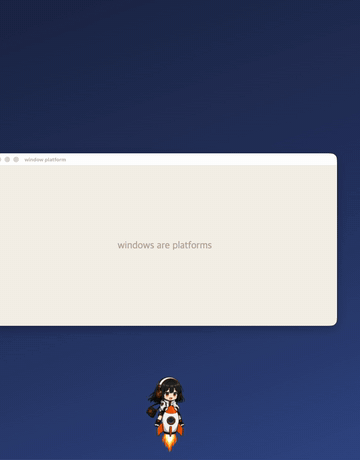
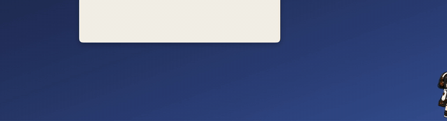
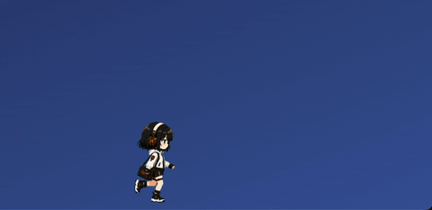

# hermes-pet

[English](README.md) · **简体中文** · [日本語](README.ja.md) · [한국어](README.ko.md)

**Hermes 在你的显示器上跑来跑去。** 这是一个开源桌面宠物：它把屏幕上的应用窗口当作踏板，
在上面行走，坐火箭飞到另一台显示器，再打开降落伞落下来，甚至还能跳到你的 iPad 上。

基于 [Tauri 2](https://tauri.app)（透明、无边框、始终置顶的窗口）和原生 TypeScript 构建。

> 角色是以 [Nous Research 的 hermes-agent](https://github.com/NousResearch) 为原型的同人角色。
> 本仓库是粉丝项目，与 hermes-agent 及 Nous Research 无关。

## 预览

<p align="center">
  
</p>
<p align="center"><sub>🚀 火箭发射 → 关闭引擎 → 降落伞 → <b>落在窗口上</b>（窗口的上边缘就是踏板）</sub></p>

<p align="center">
  
</p>
<p align="center"><sub>✈️ 横向喷气冲刺——下来时用降落伞着陆</sub></p>

<p align="center">
  
</p>
<p align="center"><sub>🚶 散步时遇到角落，就抓住它爬上去坐着</sub></p>

动作精灵图（APNG，可以直接播放）。角色以**角色包**的形式替换：默认角色包是
**Simeong（시멍）** 🐶，另附可选的 **Hermes** 🎧 角色包（在设置面板中切换）：

| 角色包 | idle | walk | rocket | jet | fall | edge |
| :-: | :-: | :-: | :-: | :-: | :-: | :-: |
| Simeong |  |  |  |  |  |  |
| Hermes |  |  |  |  |  |  |

（以上演示 GIF 均使用 Hermes 角色包录制。）

## 功能

- 🚶 **在窗口上行走**——把真实应用窗口的上边缘识别为踏板，爬上去行走；窗口移动时会跟着一起移动
- 🪂 **降落伞**——踏板消失或从高处下来时，打开降落伞缓缓下降
- 🚀 **火箭与喷气**——垂直火箭发射，以及横向乘坐的喷气冲刺
- 🖥️ **多显示器**——可在缩放比例不同的显示器（Retina + 外接）之间步行、喷气或乘火箭穿越。
  支持左右排列，也支持上下堆叠（向上坐火箭，向下俯冲）
- 📱 **iPad 接力**——如果 Lanbeam 代理（独立项目）正在运行，会在屏幕边缘跳到 iPad 上（可选功能，没有它也能完整运行）
- 🎛️ **设置界面**——右键菜单 → 设置：切换角色包，实时调整大小、速度、活跃度和特技频率（也会同步到 iPad 上的宠物）
- 🎭 **角色包**——把动作 APNG 放进 `public/packs/<名称>/`，就是一个新角色
- 🐾 **召唤伙伴**——最多可添加 3 个伙伴，每个的性格（大小、步态）略有不同
- 🔍 **识别显示**——按显示器显示叠加层，直观展示哪些窗口被识别为踏板
- ✋ **拖拽 / 💖 点击反应**——拎起来会晃来晃去，点击会冒出爱心

## 快速开始

环境要求：[Node.js](https://nodejs.org) 18+、[Rust](https://rustup.rs) 工具链。

```bash
npm install
npm run tauri dev     # 以开发模式运行
npm run tauri build   # 构建发布版应用
```

<details>
<summary><b>在 Windows 上构建</b>（实验性）</summary>

1. [安装 Rust](https://rustup.rs)——安装时选择 **MSVC 工具链**。
   如果没有 Visual Studio，需要先按 rustup 的提示安装
   [Visual Studio C++ Build Tools](https://visualstudio.microsoft.com/visual-cpp-build-tools/)
   （"Desktop development with C++" 工作负载）。
2. 安装 [Node.js](https://nodejs.org) 18+。
3. WebView2 运行时——Windows 10/11 大多已自带。如果没有，
   [在这里安装](https://developer.microsoft.com/microsoft-edge/webview2/)。
4. 之后的步骤相同：

   ```powershell
   npm install
   npm run tauri dev
   npm run tauri build   # 产物：src-tauri\target\release\bundle\
   ```

窗口踏板识别已用 Win32（`EnumWindows` + DWM）实现并确认可以编译，但尚未在真机上验证。
如果有奇怪的窗口被识别成踏板，请把它的类名加入 `src-tauri/src/lib.rs` 中的
`SHELL_CLASSES` 列表，并提交 issue 告诉我们。iPad 接力仅支持 macOS，会自动禁用。

</details>

- 操作：拖拽移动 · 点击互动 · **右键**打开菜单（伙伴+ / 设置 / 识别显示 / 退出）
- 窗口识别只使用公开 API，无需额外权限。
  （macOS `CGWindowListCopyWindowInfo` / Windows `EnumWindows` + DWM）

### 平台支持

| 平台 | 状态 |
| --- | --- |
| **macOS** | 已开发并验证（主要目标平台） |
| **Windows** | 实验性——窗口踏板识别已用 Win32 实现并确认可编译，尚未在真机上验证。欢迎提 issue！ |

iPad 接力仅支持 macOS（Lanbeam 代理是 macOS 应用）。

## 放入你自己的角色

每个动作都是 `public/packs/<角色包>/<state>.apng` 精灵图（idle / walk / drag / react /
fall / edge / rocket / jet）。用同名文件替换即可立即生效；缺少的动作会以 idle 代替。
可选的变体（`<state>.2.apng` … `<state>.4.apng`）会被随机选用。

添加新动作的流程已整理成 `.claude/skills/add-action/SKILL.md` 中的步骤，分两种模式：
用 [sprite-gen](https://github.com/aldegad/sprite-gen) 生成帧，或转换品红色背景的 GIF：

```bash
# 纯色背景 GIF → 带透明通道的 APNG（色键 + 去溢色 + 组装）
ffmpeg -i in.gif -vf "colorkey=0xFF00FF:0.12:0.08" key_%02d.png
ffmpeg -framerate 50/3 -start_number 1 -i key_%02d.png -c:v apng -plays 0 public/packs/<pack>/idle.apng
```

原始素材保存在 `art/` 中。

## 项目结构

```
src/main.ts          行为大脑：状态机（idle/walk/drag/react/fall/edge/rocket/jet）、
                     窗口踏板物理、多显示器穿越、Lanbeam 接力
src/style.css        各状态的 CSS 动效（按状态开关，避免与绘制的精灵图冲突）
src/debug.ts         按显示器的踏板识别叠加层
src/settings.ts      设置面板（持久化到 localStorage + 广播事件）
src-tauri/           Tauri 外壳：透明窗口、list_windows（CGWindowList）、Lanbeam 桥接客户端
public/packs/*/      角色包：各动作的 APNG 精灵图（可替换）
art/                 原始美术素材 + sprite-gen 生成记录
```

宠物走动时移动的是操作系统窗口本身（`setPosition`），所以它在真实的桌面上漫游，而不是在固定画布里。
跨显示器移动在 macOS 的逻辑点坐标系中计算，即使显示器缩放比例不同也不会错位。

## 致谢

本项目在以下各位的帮助下完成，非常感谢！🙏

- **Hermes 角色包角色提供**——[asin_cartel](https://www.threads.com/@asin_cartel)
- **Hermes 角色包动作 GIF 提供**（降落伞、攀爬等）——Hermes 游戏团（에르메스 게임단）的 **Nornen**
- **精灵图生成工具**——[sprite-gen](https://github.com/aldegad/sprite-gen)（@aldegad）
- Hermes 角色原型——[hermes-agent](https://hermes-agent.nousresearch.com)（Nous Research）
- Simeong（默认角色包）是 CMORE 的原创角色

## 许可证

- **代码**：[MIT](./LICENSE)
- **角色与美术素材**（`art/`、`public/packs/`）：版权归各提供者
  （asin_cartel、Nornen）所有，本项目已获得使用许可。
  这些素材不包含在代码的 MIT 许可证内，如需在其他地方使用，请先征得原作者许可。
  Fork 使用时，建议换成你自己的角色。
